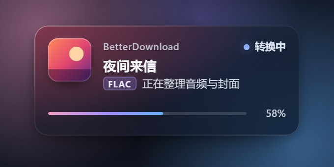
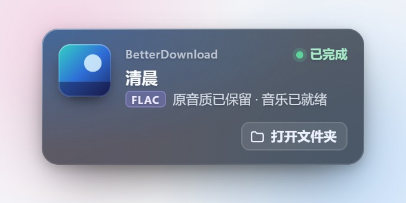
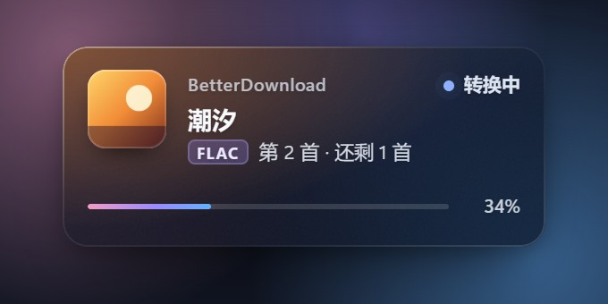
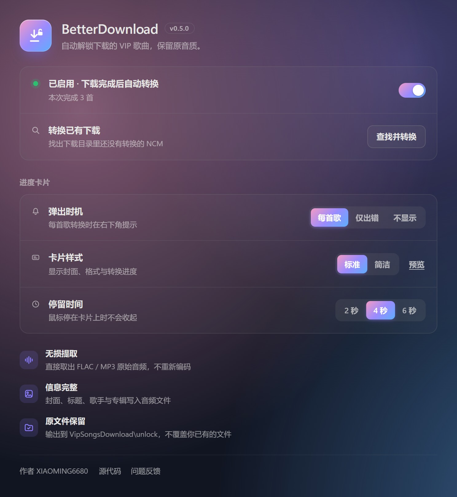

<div align="center">


# BetterDownload

**下载的 VIP 歌曲，自动变成在哪都能播放的音乐文件。**

网易云下载完成后，BetterDownload 在本地把加密的 NCM 还原成原始 FLAC / MP3，<br>
封面和歌曲信息一并写进文件。不用手动操作，原音质和原文件都保留。

[下载](https://github.com/xiaoming6680/BetterDownload/releases) · [更新记录](CHANGELOG.md) · [问题反馈](https://github.com/xiaoming6680/BetterDownload/issues)

</div>

## 为什么需要它

网易云下载的 VIP 歌曲是加密的 `.ncm` 文件，只能在网易云里播放。想放到车机、手机或其他播放器里，或者整理自己的音乐库，就得一首首找工具转换。

BetterDownload 把这一步交给插件：歌曲下载完，转换就已经做好了。

## 它是怎么工作的


```text
D:/CloudMusic/VipSongsDownload/歌手/歌曲.ncm
→ D:/CloudMusic/VipSongsDownload/unlock/歌手/歌曲.flac
```

- **原音质**：直接取出 NCM 里的原始音频，不重新编码。原来是 FLAC 就是 FLAC，是 MP3 就是 MP3，不会“升级”，也不会降质。
- **信息完整**：封面、标题、歌手、专辑和曲目号写进音频文件，换哪个播放器都能正常显示。
- **原文件保留**：结果保存在下载目录的 `VipSongsDownload/unlock`，保留歌手子文件夹；NCM 源文件原样保留，也不会覆盖你已有的同名文件。
- **完全本地**：转换在你的电脑上完成，不联网，不上传任何文件，也不依赖第三方网站。
- **只处理新下载**：订阅网易云的下载完成事件，平时不扫描你的音乐目录；有下载才启动转换程序，空闲一分钟后自动退出。

## 进度卡片

转换时右下角会出现一张小卡片，显示专辑封面、音频格式和进度，玻璃底色会随封面颜色变化。

<table>
<tr>
<td></td>
<td></td>
</tr>
<tr>
<td align="center">转换中</td>
<td align="center">完成后可直接打开文件夹（浅色主题）</td>
</tr>
<tr>
<td></td>
<td></td>
</tr>
<tr>
<td align="center">连续下载时显示第几首、还剩几首</td>
<td align="center">简洁样式：单行显示，更不打扰</td>
</tr>
</table>

鼠标停在卡片上时不会收起，离开后按设置的时间自动滑出屏幕。不想被打扰，可以在设置页改成“仅出错”或“不显示”。

> 图中的专辑封面为示意图。

## 设置页

<p align="center"></p>

- **启用开关**：随时暂停或恢复自动转换。
- **转换已有下载**：找出下载目录里以前下载、还没转换的 NCM，一键加入转换，已转换过的自动跳过。
- **进度卡片**：弹出时机（每首歌 / 仅出错 / 不显示）、样式（标准 / 简洁）、停留时间（2 / 4 / 6 秒），可以随时预览。

## 安装

1. 在 BetterNCM 插件商店搜索 **BetterDownload** 安装；也可以从 [Releases](https://github.com/xiaoming6680/BetterDownload/releases) 下载 `.plugin` 文件手动安装。
2. 重启网易云音乐。插件默认启用，之后正常下载歌曲即可。

需要 Windows、BetterNCM 1.3.4 或更新版本、网易云音乐 3.x。转换程序使用 .NET Framework 4.6.2 或更新版本，Windows 10 / 11 已自带。

## 常见问题

**下载完成后没有出现卡片？**
这首歌可能本来就是普通 FLAC / MP3，不需要解锁；也可能弹出时机被设成了“仅出错”或“不显示”。

**以前下载的歌能转换吗？**
可以。打开设置页，点“转换已有下载”里的“查找并转换”。

**提示“转换程序没有运行，可能被安全软件拦截”？**
部分安全软件会拦截插件自带的转换程序 `worker.exe`。按提示把它加入信任，插件会自动重试。

**会覆盖我原来的文件吗？**
不会。`unlock` 中已有同名文件时，新文件另存为“歌曲 (2)”。只有插件自己生成、并且你没改动过的文件，才会在重新下载同一首歌时被更新。

**封面或歌曲信息没写进去？**
音频会照常保存，卡片上会说明哪一部分没写入，例如封面格式无法识别。

**哪些情况不处理？**
UNC 网络路径、目录链接，以及 `VipSongsDownload` 以外的文件。

## 开发者

Windows 下运行：

```powershell
npm run build   # 编译 worker.exe 并打包到 dist/
npm test        # 转换、下载事件与后台处理测试
```

首次构建会从 NuGet 下载固定版本的 TagLibSharp 和 Roslyn 编译器，并校验哈希。编译启用 `/deterministic`，同一份源码在任何机器上编出的 `worker.exe` 逐字节一致，Actions 会核对仓库中的程序，详见 [构建来源](docs/BUILD.md)。

界面回归需要 Playwright，截图写入 `build/`：

```powershell
npm install --no-save playwright
$env:NBD_BROWSER_CHANNEL = 'msedge'
node scripts/ui-check.cjs
```

| 文件 | 作用 |
| --- | --- |
| `src/Worker.cs` | 任务队列、NCM 提取、文件保护与空闲退出 |
| `src/Metadata.cs` | 用 TagLibSharp 写入封面与标签 |
| `plugin/download-hook.js` | 订阅网易云下载完成事件 |
| `plugin/main.js` | 设置页与转换程序的生命周期 |
| `plugin/progress-card.js` | 进度卡片 |

验证记录见 [VALIDATION.md](docs/VALIDATION.md)，发布流程见 [PUBLISHING.md](docs/PUBLISHING.md)。

## 开源协议

GPL-3.0-or-later。TagLibSharp 2.3.0 的 LGPL 许可证与源码地址见 `plugin/TAGLIB-LICENSE` 和 `plugin/NOTICE.md`。

作者 [XIAOMING6680](https://github.com/xiaoming6680)。插件标识为 `ncm-better-download`。
